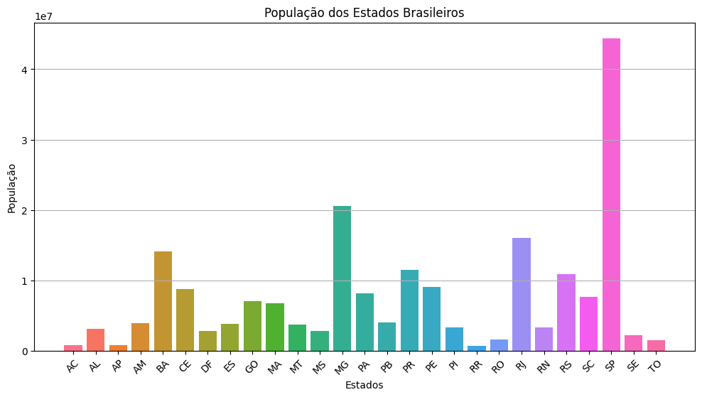
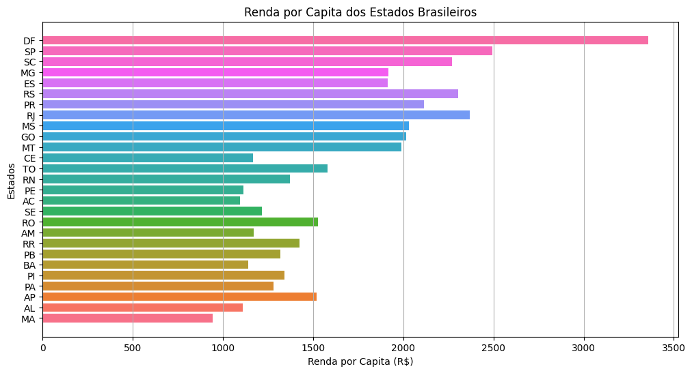
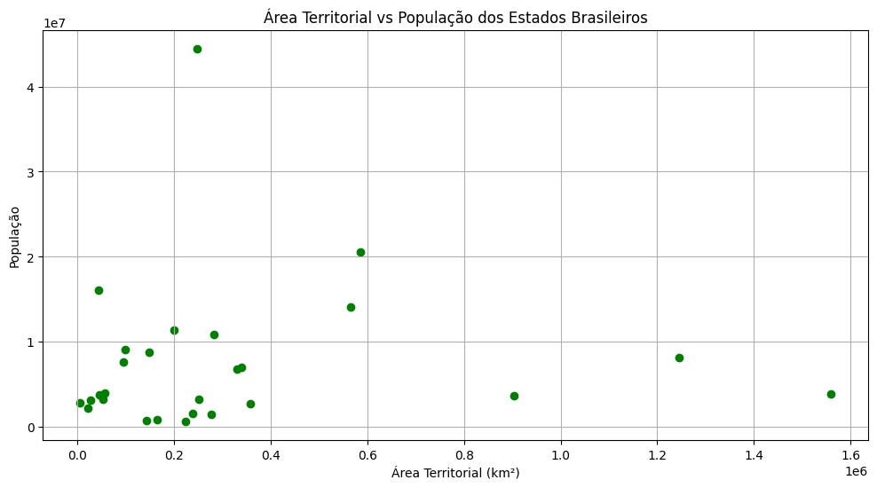
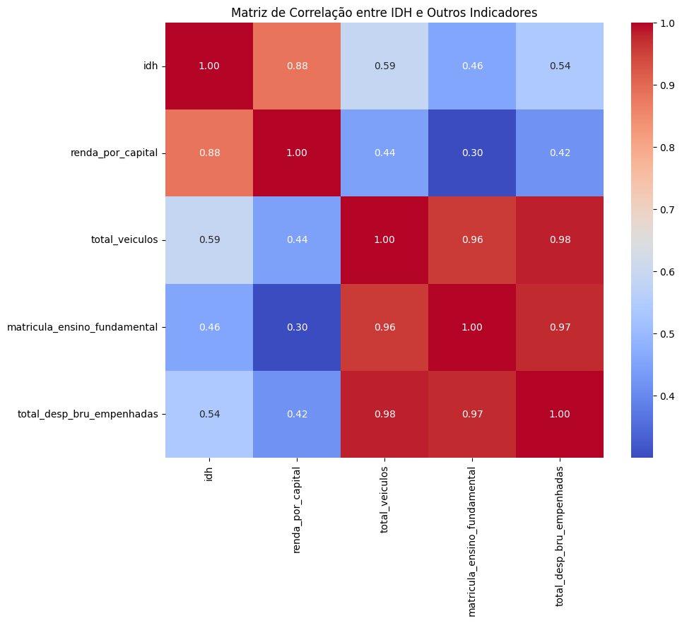
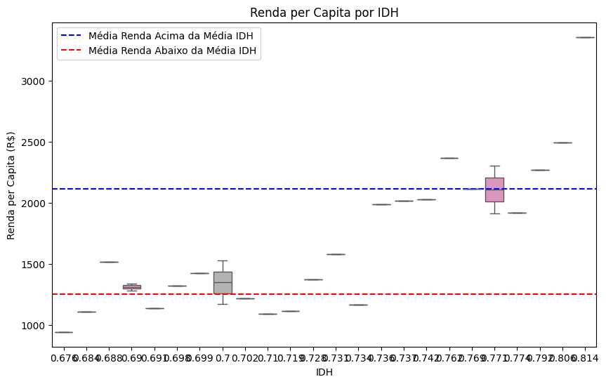

## Análise comparativa dos indicadores socioeconômicos dos estados brasileiros  🚀 🚀 🚀 🚀

---

### Objetivos

---

* **Objetivo Geral:**
  * Identificar padrões, tendências e disparidades entre os estados brasileiros com base nos indicadores apresentados, buscando compreender as relações entre esses indicadores e as possíveis causas dessas diferenças.

---

### Perguntas

---

1. **Quais são os estados com as maiores e menores populações?**

---

2. **Como a renda per capita varia entre os estados?**

---

3. **Existe uma correlação entre a área territorial dos estados e seus indicadores socioeconômicos?**

---

4. **Quais são os estados com as maiores disparidades na matrícula no ensino fundamental?**

---

5. **Como o Índice de Desenvolvimento Humano (IDH) se relaciona com outros indicadores socioeconômicos?**

---

6. **A renda per capita varia significativamente entre os estados brasileiros com IDH acima da média e aqueles com IDH abaixo ou igual à média?**

"""
Pergunta da Hipótese:
Hipótese Nula (𝐻0): Não há diferença significativa na renda per capita entre os estados com IDH acima da média e os estados com IDH abaixo ou igual à média.

Hipótese Alternativa (𝐻1): Há uma diferença significativa na renda per capita entre os estados com IDH acima da média e os estados com IDH abaixo ou igual à média.
"""

---

### Bases de Dados

---

* **Fonte 1:**
  * Coleta de dados do IBGE por meio de web scraping permitiu construir um dataset abrangente sobre os indicadores sociais e econômicos dos estados brasileiros.
  link [Texto do link](URL)

[AC -](https://www.ibge.gov.br/cidades-e-estados/ac.html)
[AL - ](https://www.ibge.gov.br/cidades-e-estados/al.html)
[AP - ](https://www.ibge.gov.br/cidades-e-estados/ap.html)
[AM - ](https://www.ibge.gov.br/cidades-e-estados/am.html)
[BA - ](https://www.ibge.gov.br/cidades-e-estados/ba.html)
[CE - ](https://www.ibge.gov.br/cidades-e-estados/ce.html)
[DF - ](https://www.ibge.gov.br/cidades-e-estados/df.html)
[ES - ](https://www.ibge.gov.br/cidades-e-estados/es.html)
[GO - ](https://www.ibge.gov.br/cidades-e-estados/go.html)
[MA - ](https://www.ibge.gov.br/cidades-e-estados/ma.html)
[MT - ](https://www.ibge.gov.br/cidades-e-estados/mt.html)
[MS - ](https://www.ibge.gov.br/cidades-e-estados/ms.html)
[MG - ](https://www.ibge.gov.br/cidades-e-estados/mg.html)
[PA - ](https://www.ibge.gov.br/cidades-e-estados/pa.html)
[PB - ](https://www.ibge.gov.br/cidades-e-estados/pb.html)
[PR - ](https://www.ibge.gov.br/cidades-e-estados/pr.html)
[PE - ](https://www.ibge.gov.br/cidades-e-estados/pe.html)
[PI - ](https://www.ibge.gov.br/cidades-e-estados/pi.html)
[RR - ](https://www.ibge.gov.br/cidades-e-estados/rr.html)
[RO - ](https://www.ibge.gov.br/cidades-e-estados/ro.html)
[RJ - ](https://www.ibge.gov.br/cidades-e-estados/rj.html)
[RN - ](https://www.ibge.gov.br/cidades-e-estados/rn.html)
[RS - ](https://www.ibge.gov.br/cidades-e-estados/rs.html)
[SC - ](https://www.ibge.gov.br/cidades-e-estados/sc.html)
[SP - ](https://www.ibge.gov.br/cidades-e-estados/sp.html)
[SE - ](https://www.ibge.gov.br/cidades-e-estados/se.html)
[TO - ](https://www.ibge.gov.br/cidades-e-estados/to.html)

---

### Ferramentas Utilizadas

---

* **Linguagem de Programação:** Python
* **Bibliotecas:** Pandas, NumPy, Seaborn, Matplotlib, BeautifulSoup, Scipy
* **Ambiente de Desenvolvimento:** Jupyter Notebook e Visual Studio Code